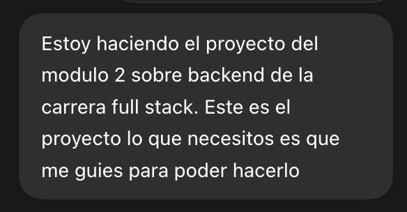
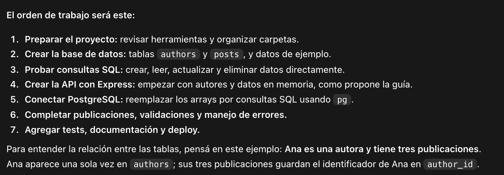
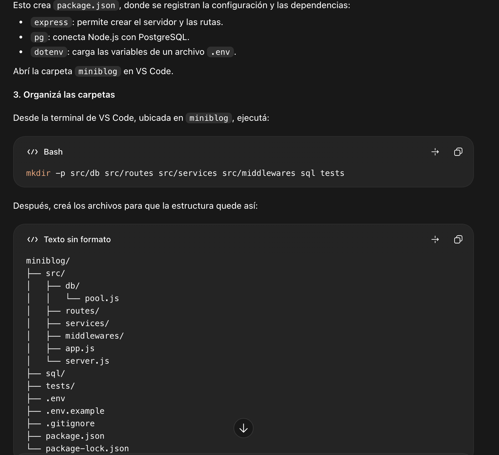
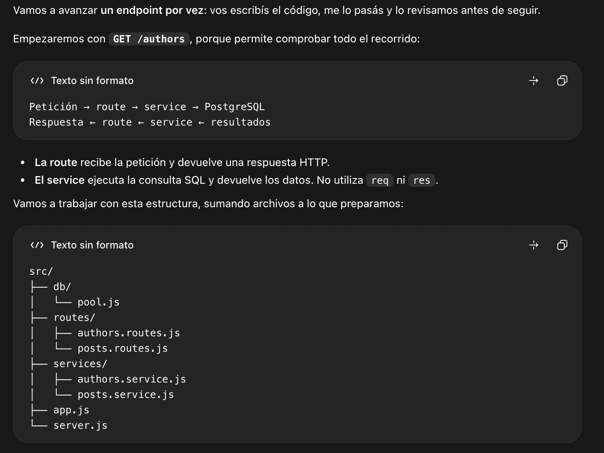
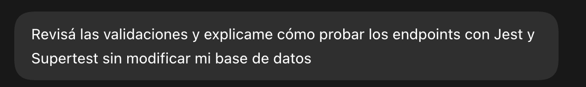
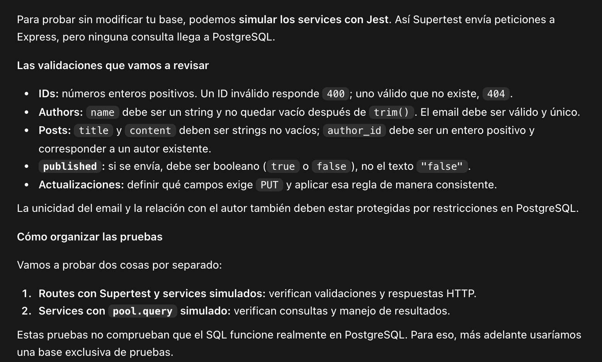

# MiniBlog API

## Descripción del proyecto

MiniBlog es una API REST desarrollada con Node.js, Express y PostgreSQL para gestionar autores y publicaciones. Permite crear, consultar, actualizar y eliminar ambos recursos, además de listar las publicaciones asociadas a un autor.

El proyecto fue realizado como trabajo integrador del Módulo 2 para aplicar conexión entre Express y PostgreSQL, consultas SQL parametrizadas, operaciones CRUD, validación de datos, manejo de errores, testing y documentación OpenAPI.

## Requisitos y ejecución local

### Requisitos

- Node.js 18 o superior.
- npm.
- PostgreSQL.
- El comando `psql` disponible en la terminal.

### Instalación

1. Clonar el repositorio y entrar en la carpeta:

```bash
git clone https://github.com/carmuegaaldana/ProyectoM2-CarmuegaAldana.git
cd miniblog-api
```

2. Instalar las dependencias:

```bash
npm install
```

3. Crear `.env` a partir del archivo de ejemplo:

```bash
cp .env.example .env
```

4. Completar `.env` con las credenciales locales de PostgreSQL:

```env
DB_HOST=localhost
DB_PORT=5432
DB_NAME=miniblog
DB_USER=postgres
DB_PASSWORD=your_password
PORT=3000
```

El archivo `.env` contiene información privada y no debe subirse al repositorio.

### Preparación de PostgreSQL

Crear la base de datos:

```bash
psql -U postgres -c "CREATE DATABASE miniblog;"
```

Crear las tablas:

```bash
psql -U postgres -d miniblog -f sql/setup.sql
```

Cargar los datos iniciales:

```bash
psql -U postgres -d miniblog -f sql/seed.sql
```

`seed.sql` debe ejecutarse una sola vez sobre una base vacía porque los emails de los autores son únicos.

### Iniciar la API

Modo desarrollo:

```bash
npm run dev
```

Ejecución normal:

```bash
npm start
```

La API local estará disponible en `http://localhost:3000`.

## Ejecución de tests

Ejecutar las pruebas automatizadas:

```bash
npm test
```

Los tests utilizan Jest y Supertest. Los servicios se simulan mediante mocks, por lo que las pruebas de rutas no modifican la base de datos local.

## Documentación OpenAPI

La especificación se encuentra en `docs/openapi.yaml`.

Para visualizarla:

1. Abrir [Swagger Editor](https://editor.swagger.io/).
2. Seleccionar **File > Import file**.
3. Elegir el archivo `docs/openapi.yaml`.

La documentación incluye los esquemas, parámetros, cuerpos y respuestas HTTP de los endpoints de autores y posts.

## Deployment en Railway

1. Crear un proyecto en Railway.
2. Agregar un servicio PostgreSQL.
3. Conectar el repositorio de GitHub como servicio de la API.
4. Configurar las variables `DB_HOST`, `DB_PORT`, `DB_NAME`, `DB_USER`, `DB_PASSWORD` y `PORT` con los datos del servicio PostgreSQL de Railway.
5. Ejecutar `sql/setup.sql` y `sql/seed.sql` en la base remota.
6. Utilizar `npm start` como comando de inicio.
7. Generar un dominio público y comprobar los endpoints.

Datos que se completarán después del despliegue:

```text
Internal URL: PENDIENTE
Public URL: PENDIENTE
```

Las credenciales de Railway no deben incluirse en el repositorio.

## Registro del uso de IA

Se utilizó una herramienta de inteligencia artificial como acompañamiento durante el proyecto. La IA ayudó a interpretar la consigna, organizar el trabajo en etapas, revisar el código, explicar errores y preparar la documentación. El código fue probado paso a paso y las decisiones fueron revisadas durante el desarrollo.

Los textos siguientes son resúmenes representativos de las consultas realizadas. Las capturas muestran las interacciones reales utilizadas como evidencia.

### Prompt 1: análisis y forma de trabajo

> Este es el proyecto. No quiero que lo resuelvas; quiero que me guíes para poder hacerlo.

La respuesta permitió identificar los entregables obligatorios y organizar el desarrollo por etapas.





### Prompt 2: creación y configuración del proyecto

> Guiame para preparar las carpetas, iniciar Node.js y conectar el proyecto con PostgreSQL mediante variables de entorno.

La IA explicó la estructura de carpetas, la función de `.env`, la conexión mediante `pg` y la separación entre `app.js` y `server.js`.




### Prompt 3: implementación del CRUD

> Guiame para implementar los endpoints de authors y posts separando routes y services, y revisá el código que voy escribiendo.

La IA orientó la creación gradual de los endpoints y explicó el uso de consultas SQL parametrizadas y códigos HTTP.




### Prompt 4: validaciones y pruebas

> Revisá las validaciones y explicame cómo probar los endpoints con Jest y Supertest sin modificar mi base de datos.

La IA ayudó a incorporar validaciones, middleware de errores y pruebas con servicios simulados mediante mocks.




